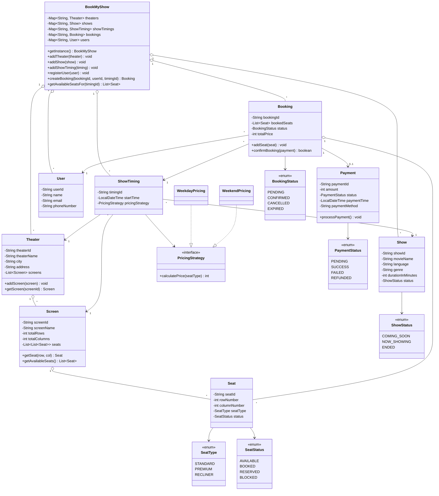

# LLD BookMyShow

This repository contains a low-level design implementation of a BookMyShow-like movie ticket booking system in Java. The project models theaters, screens, seats, shows, show timings, bookings, payments, and pricing strategies in a small, interview-friendly design.

The actual Java source code lives in `book-my-show-design/book-my-show/`. A more focused project write-up also exists inside that folder, while this root README gives a broader repository-level overview.

## Repository Structure

```text
LLD-Book_my_show/
├── .gitignore
├── README.md
└── book-my-show-design/
    └── book-my-show/
        ├── Main.java
        ├── BookMyShow.java
        ├── Booking.java
        ├── Payment.java
        ├── PricingStrategy.java
        ├── Screen.java
        ├── Seat.java
        ├── Show.java
        ├── ShowTiming.java
        ├── Theater.java
        ├── User.java
        ├── WeekdayPricing.java
        ├── WeekendPricing.java
        ├── BookingStatus.java
        ├── PaymentStatus.java
        ├── SeatStatus.java
        ├── SeatType.java
        ├── ShowStatus.java
        ├── bookmyshow.png
        └── README.md
```

## Project Objective

This codebase demonstrates how a ticket-booking platform can be modeled using object-oriented design principles and common design patterns. It focuses on:

- representing the core domain entities clearly
- separating responsibilities across small classes
- showing basic extensibility through interfaces and enums
- simulating a full booking workflow from setup to payment confirmation

## Core Features

- Multi-theater support across cities
- Multiple screens per theater
- Grid-based seat generation and lookup
- Seat categorization with different base prices
- Show and show-timing management
- Booking creation and seat reservation
- Payment lifecycle simulation
- Seat availability tracking
- User registration and booking history
- Dynamic pricing through strategy implementations
- Console-based demo flow in `Main.java`

## Design Patterns Used

### 1. Singleton Pattern

`BookMyShow` is implemented as a singleton so the system uses one central platform instance to manage theaters, shows, show timings, users, and bookings.

### 2. Strategy Pattern

`PricingStrategy` is an interface that allows the platform to vary ticket pricing without changing booking logic.

Current implementations:

- `WeekdayPricing`: applies a discounted price
- `WeekendPricing`: applies a premium price

### 3. Enum-Based State Modeling

State transitions are modeled using enums:

- `SeatStatus`: `AVAILABLE`, `BOOKED`, `RESERVED`, `BLOCKED`
- `BookingStatus`: `PENDING`, `CONFIRMED`, `CANCELLED`, `EXPIRED`
- `PaymentStatus`: `PENDING`, `SUCCESS`, `FAILED`, `REFUNDED`
- `ShowStatus`: `COMING_SOON`, `NOW_SHOWING`, `ENDED`

## SOLID Principles Reflected

- Single Responsibility Principle: each class has a focused domain role
- Open/Closed Principle: pricing behavior can be extended through new `PricingStrategy` implementations
- Liskov Substitution Principle: any pricing implementation can be used where `PricingStrategy` is expected
- Interface Segregation Principle: the pricing abstraction is small and purpose-driven
- Dependency Inversion Principle: `ShowTiming` depends on the `PricingStrategy` abstraction instead of concrete pricing classes

## Key Classes And Responsibilities

### `BookMyShow`

Acts as the system coordinator. It stores and retrieves:

- theaters
- shows
- show timings
- users
- bookings

It also provides helper operations such as:

- registering users
- creating bookings
- fetching theaters by city
- getting available seats for a show timing
- showing a seat layout in the console

### `Theater`

Represents a theater in a city and manages a list of screens.

### `Screen`

Represents an auditorium within a theater. It initializes a two-dimensional seat layout and provides:

- seat lookup by row and column
- retrieval of available seats

### `Seat`

Represents an individual seat with:

- seat identifier
- row and column position
- seat type
- current seat status

### `SeatType`

Encodes seat category and base price:

- `STANDARD`
- `PREMIUM`
- `RECLINER`

### `Show`

Represents movie metadata such as:

- movie name
- language
- genre
- duration
- show status

### `ShowTiming`

Represents a scheduled screening by combining:

- one `Show`
- one `Theater`
- one `Screen`
- one `LocalDateTime`
- one `PricingStrategy`

### `User`

Represents the customer using the platform.

### `Booking`

Captures the booking transaction and manages:

- selected seats
- booking status
- total price calculation
- final confirmation against payment success

When seats are added, their status changes from `AVAILABLE` to `RESERVED`. Once payment succeeds and the booking is confirmed, the seats become `BOOKED`.

### `Payment`

Represents payment metadata including:

- amount
- payment method
- payment status
- payment timestamp

The current implementation simulates a successful payment.

## Booking Flow

The system follows this high-level process:

1. Create theaters and screens.
2. Create shows and mark their status.
3. Create show timings for particular screens and dates.
4. Register users.
5. Create a booking for a user and a selected show timing.
6. Add seats to the booking.
7. Calculate the total ticket price using the active pricing strategy.
8. Process payment.
9. Confirm the booking and mark reserved seats as booked.

## UML Diagram

The following Mermaid class diagram represents the main structure of the design:



## Sequence Overview

A simplified runtime interaction looks like this:

```text
User -> BookMyShow -> createBooking()
Booking -> ShowTiming -> getPricingStrategy()
Booking -> Seat -> reserve seats
Payment -> processPayment()
Booking -> confirmBooking(payment)
Seat -> status becomes BOOKED
```

## How To Run

Move to the Java source directory and run the demo:

```bash
cd book-my-show-design/book-my-show
javac *.java
java Main
```

## Expected Demo Coverage

The console demo in `Main.java` shows:

- theater and screen setup
- show and show-timing creation
- user registration
- seat layout display
- seat selection
- total price calculation
- payment processing
- booking confirmation
- updated seat availability
- user booking history

## Current Limitations

This is a clean LLD/demo implementation, so a few production concerns are intentionally simplified:

- no concurrency handling for simultaneous seat booking
- no persistence or database integration
- no authentication or authorization
- no real payment gateway integration
- no cancellation and refund workflow implementation
- no search, filtering, or recommendation engine
- no exception hierarchy beyond simple validation errors

## Possible Enhancements

- add cancellation and refund support
- support temporary seat locks with timeout expiry
- add city-based show discovery and filtering
- implement coupon and promotional pricing
- add occupancy-based dynamic pricing
- separate service layer from domain models
- persist data to a database
- expose REST APIs on top of the domain model

## Notes

- No source code was modified while expanding this documentation.
- The original detailed project README remains available in `book-my-show-design/book-my-show/README.md`.
