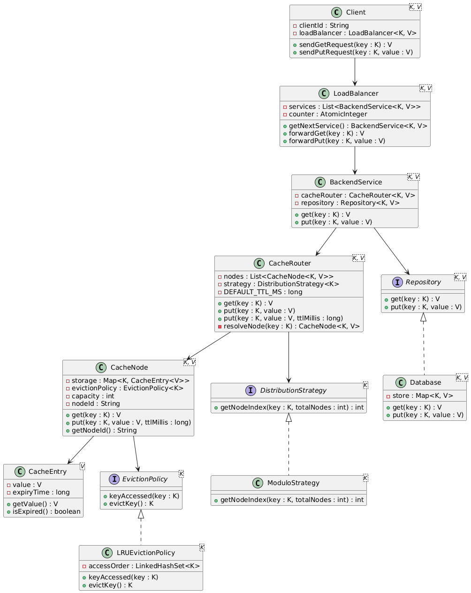

# Distributed Cache

## Requirements

**Functional**
- `get(key)` — return from cache if present; else fetch from DB, store in cache, return value
- `put(key, value)` — store in the appropriate cache node
- Cache is distributed across multiple configurable nodes

**Design**
- **Pluggable distribution strategy** — modulo-based now; easy to swap to consistent hashing
- **Pluggable eviction policy** — LRU now; easy to swap to MRU / LFU
- Flexible and extensible OO design

---

## Design

**Layers:**

| Layer | Classes |
|---|---|
| Client | `Client` → `LoadBalancer` |
| Service | `BackendService` (read-through, write-through) |
| Cache | `CacheRouter` → `CacheNode` → `CacheEntry` |
| Distribution | `DistributionStrategy` ← `ModuloStrategy` |
| Eviction | `EvictionPolicy` ← `LRUEvictionPolicy` |
| Database | `Repository` ← `Database` |

**Key design decisions:**
- `CacheRouter` uses `DistributionStrategy` to route keys → `Math.abs(hash) % nodes` (modulo)
- `CacheNode` delegates eviction to `EvictionPolicy`; LRU uses a `LinkedHashSet` for O(1) access tracking
- Cache miss → DB lookup → write-back into cache (read-through)
- `put` writes to both cache and DB (write-through)
- `CacheEntry` carries a TTL; expired entries are lazily removed on `get`

---

## Design Patterns

| Pattern | Where used | Purpose |
|---|---|---|
| **Strategy** | `DistributionStrategy` + `ModuloStrategy` | Encapsulates the node-routing algorithm; swap to consistent hashing without touching `CacheRouter` |
| **Strategy** | `EvictionPolicy` + `LRUEvictionPolicy` | Encapsulates the eviction algorithm; swap to MRU/LFU without touching `CacheNode` |
| **Facade** | `BackendService` | Provides a single `get`/`put` surface hiding the cache tier, DB tier, and read-through / write-through coordination |
| **Proxy** | `LoadBalancer` | Sits in front of `BackendService` instances, transparently forwarding client requests via round-robin |

---

## UML



---

## Compile & Run

```powershell
cd DistributedCache
javac -d out -sourcepath . Main.java
java -cp out Main
```
