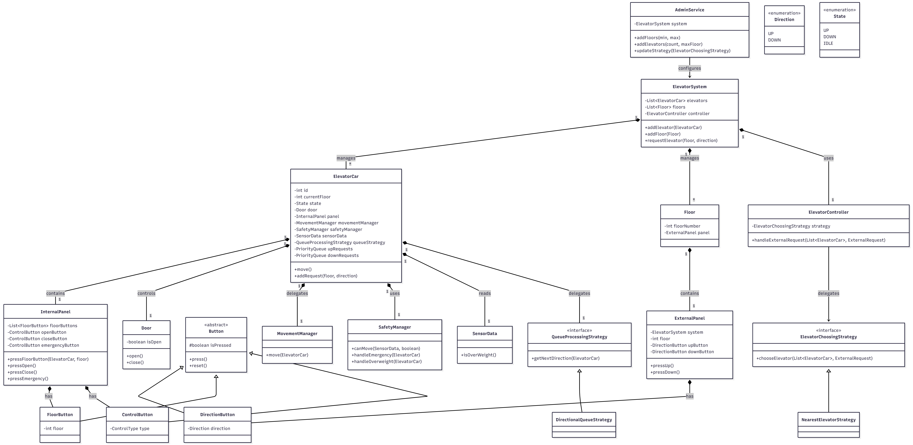

# Elevator Management System

A scalable, object-oriented design of a multi-elevator system that models real-world elevator behavior. The system separates input handling, request routing, and physical execution, enabling clean abstractions, extensibility, and maintainability.

---

## Design Philosophy

The system is designed around a clear separation of concerns:

* **Input Layer (Panels):** Captures user interactions through buttons
* **Control Layer (Controller):** Assigns requests to the most suitable elevator
* **Execution Layer (ElevatorCar):** Handles movement, safety, and door operations

This structure closely reflects real-world elevator systems, where user input is decoupled from routing logic and each elevator operates independently.

---

## Core Features

### Button Handling (Internal and External)

* External requests are captured via `ExternalPanel`
* Internal requests are handled via `InternalPanel`
* Button abstraction includes:

  * `DirectionButton`
  * `FloorButton`
  * `ControlButton`

---

### Elevator State Management

Elevator states are modeled using an enum:

* `UP`
* `DOWN`
* `IDLE`

The state is updated dynamically during each simulation step.

---

### Pluggable Strategy Pattern

Elevator assignment is handled through a strategy interface:

* `ElevatorChoosingStrategy`

Default implementation:

* `NearestElevatorStrategy`

This allows easy extension for alternative strategies such as FCFS or load-based selection.

---

### Queue Scheduling Strategy

Each elevator manages its own request queue using:

* `QueueProcessingStrategy`

Default implementation:

* `DirectionalQueueStrategy`

This ensures efficient servicing of requests by minimizing unnecessary direction changes.

---

### Safety Handling

#### Overweight Handling

* Based on `SensorData`
* Managed by `SafetyManager`
* Prevents movement and triggers an alarm

#### Emergency Handling

* Triggered via `InternalPanel`
* Immediately halts the elevator
* Opens doors and activates alarm

---

### Multi-Elevator Coordination

* Managed by `ElevatorController`
* Assigns exactly one elevator per request
* Uses pluggable strategies for decision-making

---

### Floor Constraints

* Ground floor does not allow `DOWN` requests
* Top floor does not allow `UP` requests

These constraints are enforced during `Floor` initialization to prevent invalid inputs.

---

## System Flow

```text
User → Panel (Button Press)
        ↓
ElevatorSystem
        ↓
ElevatorController (Strategy)
        ↓
Assigned ElevatorCar
        ↓
MovementManager + SafetyManager
```

---

## Architecture Overview

### Design Patterns Used

* **Strategy Pattern**

  * Elevator selection (`ElevatorChoosingStrategy`)
  * Queue processing (`QueueProcessingStrategy`)

---

### Responsibility Separation

* Movement logic: `MovementManager`
* Safety logic: `SafetyManager`
* Input handling: Panels
* Request routing: `ElevatorController`

---

### Extensibility

The system is designed to support:

* New elevator assignment strategies
* Additional safety mechanisms
* Alternative scheduling algorithms
* New operational modes

---

## Key Design Decisions

### No Floor Sensor Abstraction

The `currentFloor` is maintained as internal system state since movement is controlled by the system itself. This avoids unnecessary hardware-level abstraction.

---

### Minimal Sensor Modeling

Only external inputs such as weight are modeled using `SensorData`. Complex event-driven sensor systems (e.g., Observer pattern) are intentionally avoided to keep the design simple and focused.

---

### Panels as Entry Points

Panels act as the interface between users and the system, ensuring that input handling is decoupled from business logic.

---

### Single Elevator per Request

Each request is assigned to exactly one elevator through the controller and strategy layer, preventing duplication and ensuring consistency.

---

## UML Class Diagram

Refer to the UML diagram below for class relationships and structure:



---

## Running the Simulation

Compile and run the system using:

```bash
javac *.java
java ElevatorDesign.Main
```

